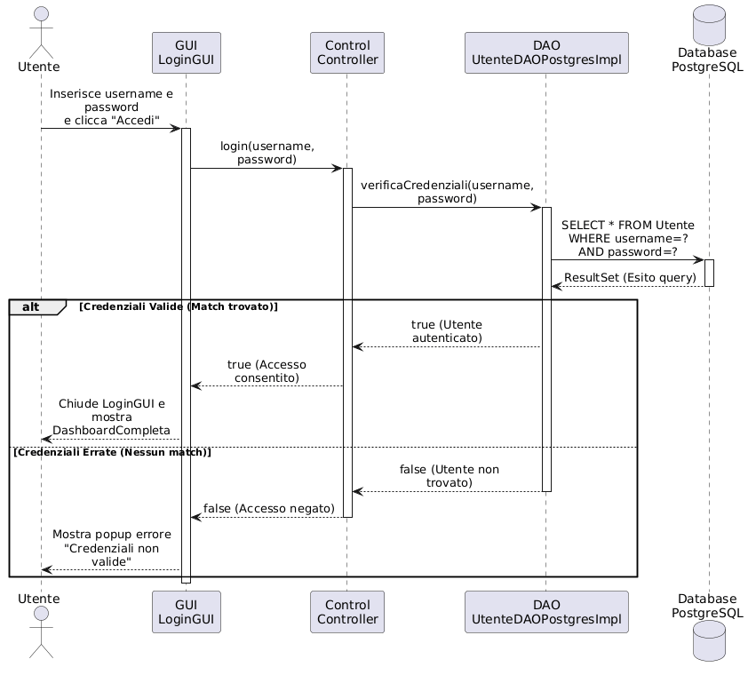
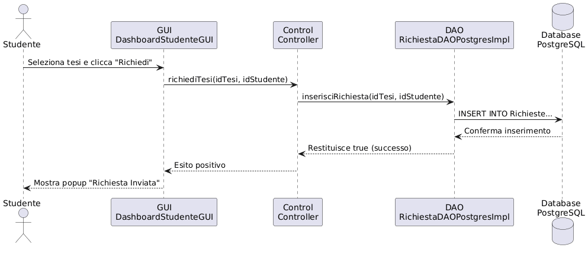

# Sistema Gestione Tesi e Tirocini

**Progetto Universitario - Università degli Studi di Napoli Federico II**  
**Terzo Homework**  
**Componenti del Gruppo 22:** Agostino Landolfo e Raffaele Dipinto

---

## 1. Introduzione e Architettura
Il presente progetto implementa un sistema software per la gestione integrata delle tesi di laurea e dei tirocini universitari (curriculari, extracurriculari ed esteri). 

L'ingegnerizzazione dell'applicativo si basa sul pattern architetturale **Model-View-Controller (MVC)**, il quale garantisce un netto disaccoppiamento tra l'interfaccia grafica utente, la logica di business e il dominio applicativo. Per permettere la persistenza dei dati, il sistema integra il layer **Data Access Object (DAO)**, interfacciato a un database relazionale **PostgreSQL**.

## 2. Struttura dei Package
L'architettura del sistema è partizionata in moduli ad alta coesione:
*   `model`: Contiene le entità di dominio progettate secondo i principi della programmazione orientata agli oggetti.
*   `controller`: Coordina i flussi applicativi, intercetta le richieste della GUI e manipola il Model attraverso il layer DAO.
*   `gui`: Interfaccia grafica utente implementata in **Java Swing**, delegata esclusivamente alla presentazione dei dati.
*   `dao`: Interfacce pubbliche che definiscono i contratti per le operazioni di persistenza (CRUD).
*   `implementazionepostgresdao`: Classi concrete che implementano le interfacce DAO eseguendo le query sul database.
*   `database`: Contiene la classe `DBConnection`, implementata tramite pattern **Singleton** per ottimizzare e centralizzare l'accesso ai dati.

## 3. Qualità del Codice e Sicurezza
Il codice è stato sviluppato e sottoposto a refactoring per minimizzare la presenza di code smells e garantire robustezza:
*   **Prevenzione SQL Injection:** Le interrogazioni al database utilizzano esclusivamente `PreparedStatement`.
*   **Gestione Sicura delle Eccezioni:** Il tracciamento degli errori non fa uso di standard output non sicuri, ma è interamente delegato alla libreria `java.util.logging.Logger`.
*   **Documentazione Javadoc:** Le interfacce e i metodi di sistema sono documentati secondo gli standard formali per agevolare la manutenibilità del codice.

---

## 4. Manuale d'Uso Rapido

### 4.1 Requisiti di Sistema
*   **Java Development Kit (JDK)**.
*   **PostgreSQL** installato e in esecuzione in locale (porta di default `5432`).
*   **Driver JDBC per PostgreSQL** referenziato nel classpath del progetto.

### 4.2 Configurazione e Avvio
1.  Assicurarsi di aver predisposto il database `gestione_tesi`. Le credenziali di accesso di default (`postgres`/`postgres`) possono essere configurate liberamente all'interno della classe `DBConnection.java`.
2.  Eseguire la classe `Main` (o `LoginGUI`) per avviare il sistema.
3.  Effettuare l'autenticazione. Il Controller riconoscerà polimorficamente i privilegi dell'utente (Studente, Docente, Coordinatore), abilitando i relativi flussi operativi (es. inserimento richieste tirocinio, visualizzazione stato tesi, calendarizzazione sedute).

---

## 5. Documentazione UML
A corredo del codice sorgente, di seguito sono riportati i diagrammi UML richiesti per la valutazione architetturale del software, che mostrano l'integrazione dei moduli e le interazioni cross-package.

### Class Diagram di Dettaglio
Modello strutturale completo di tutti i moduli realizzati (Tesi e Tirocini), comprensivo dell'integrazione del layer Persistence (DAO).

---

### Sequence Diagram - Autenticazione (Login)
Rappresentazione dinamica del flusso di autenticazione, che modella l'interazione tra i livelli View, Controller, Persistence e il Database PostgreSQL.

### Sequence Diagram - Autenticazione (Tesi)
Rappresentazione dinamica del flusso operativo per la sottomissione di una richiesta all'interno del sistema.

