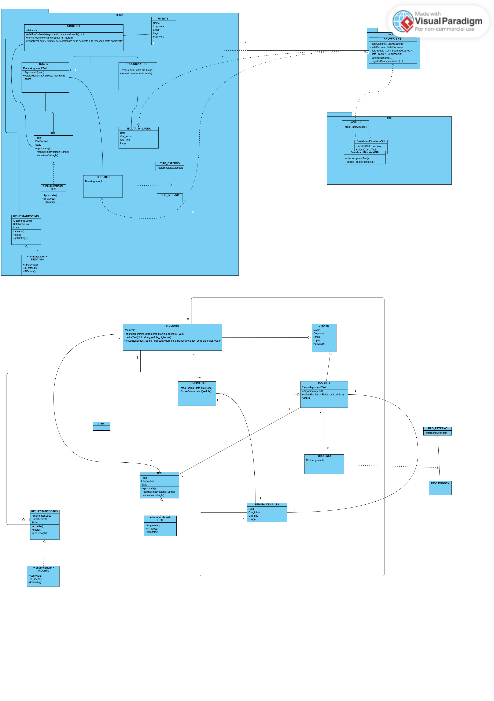

# Relazione Tecnica: Specifica del Class Diagram
**Sistema Gestione Tesi -- Milestone 2** *Componenti del Gruppo 22: Agostino Landolfo*

---

## 1. Introduzione
Il presente documento espone in modo formale l'analisi strutturale e le specifiche di dettaglio delle classi.

L'ingegnerizzazione dell'applicativo si basa sul pattern architetturale **Model-View-Controller (MVC)**. Tale scelta progettuale garantisce l'alta coesione dei moduli e un netto disaccoppiamento tra la persistenza dei dati (Model), l'interfaccia grafica utente (View) e la logica di business preposta al controllo dei flussi (Controller).

## 2. Architettura e Pattern MVC
L'applicazione è partizionata in tre macro-pacchetti logici:
* **Model**: Contiene le entità di dominio del sistema. Non ha alcuna conoscenza dell'interfaccia grafica.
* **Controller**: Coordina l'applicazione, intercetta le richieste inviate dalla View, esegue le computazioni di business logic e aggiorna lo stato delle entità.
* **GUI (View)**: Gestisce esclusivamente la presentazione visiva e la cattura dell'input utente tramite la libreria desktop Java Swing.

## 3. Class Diagram di Dettaglio
Di seguito viene riportato il diagramma delle classi modellato mediante lo strumento CASE *Visual Paradigm*.

## 4. Dettaglio delle Classi e Modificatori

### 4.1 Pacchetto Model
Il modello implementa i principi della programmazione orientata agli oggetti (OOP), in particolare l'incapsulamento dei dati e l'ereditarietà (*Generalization*).
* **UTENTE**: Superclasse astratta che centralizza i dati comuni di autenticazione ed anagrafica (`username`, `password`, `nome`, `cognome`).
* **STUDENTE**: Specializzazione di `UTENTE`. Introduce la `matricola` e i metodi per la visualizzazione dello stato della tesi.
* **DOCENTE**: Specializzazione di `UTENTE`. Gestisce l'elenco degli argomenti di tesi associati.
* **COORDINATORE**: Specializzazione di `UTENTE`. Detiene i privilegi operativi di livello superiore (es. gestione commissioni).

### 4.2 Pacchetto Controller
* **Controller**: Mantiene i riferimenti globali alle collezioni in-memory degli utenti (`List<UTENTE>`). Espone pubblicamente il metodo `login(username, password)` che implementa la logica di scansione polimorfica per l'autenticazione.

### 4.3 Pacchetto GUI
* **LoginGUI**: Estende la classe nativa `JFrame`. Contiene i componenti grafici delegando la verifica delle credenziali al `Controller` associato.

## 5. Analisi delle Relazioni UML
Le relazioni strutturali seguono rigorosi vincoli di dipendenza:
1. **Generalizzazione**: Connette `STUDENTE`, `DOCENTE` e `COORDINATORE` verso la superclasse `UTENTE`.
2. **Associazione Unidirezionale**: `LoginGUI` detiene una variabile di istanza di tipo `Controller` con molteplicità 1, permettendo alla View di disaccoppiare la logica.
3. **Dipendenza**: Il `Controller` manipola le entità del modello, determinando una relazione di dipendenza verso il tipo astratto `UTENTE` durante l'autenticazione polimorfica a runtime.
